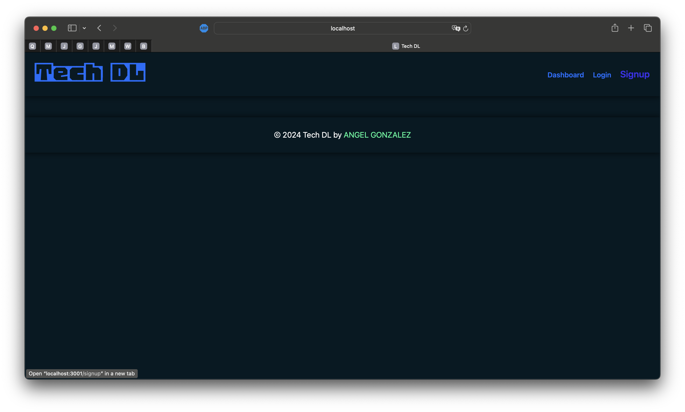
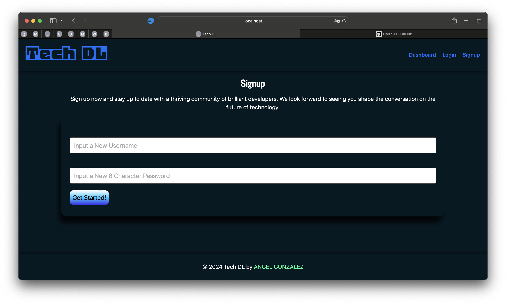
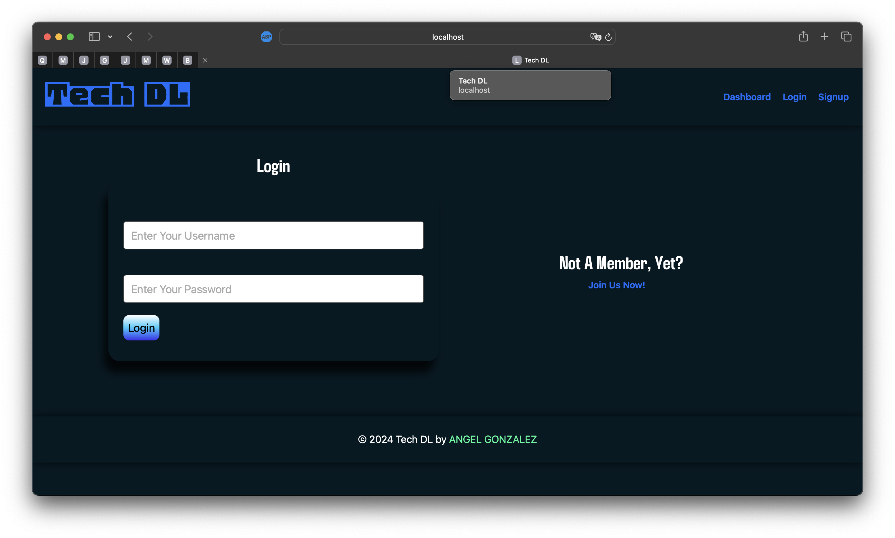
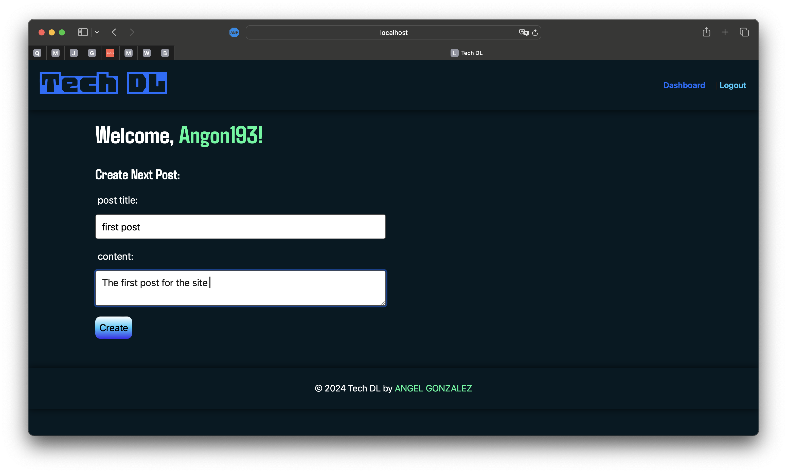
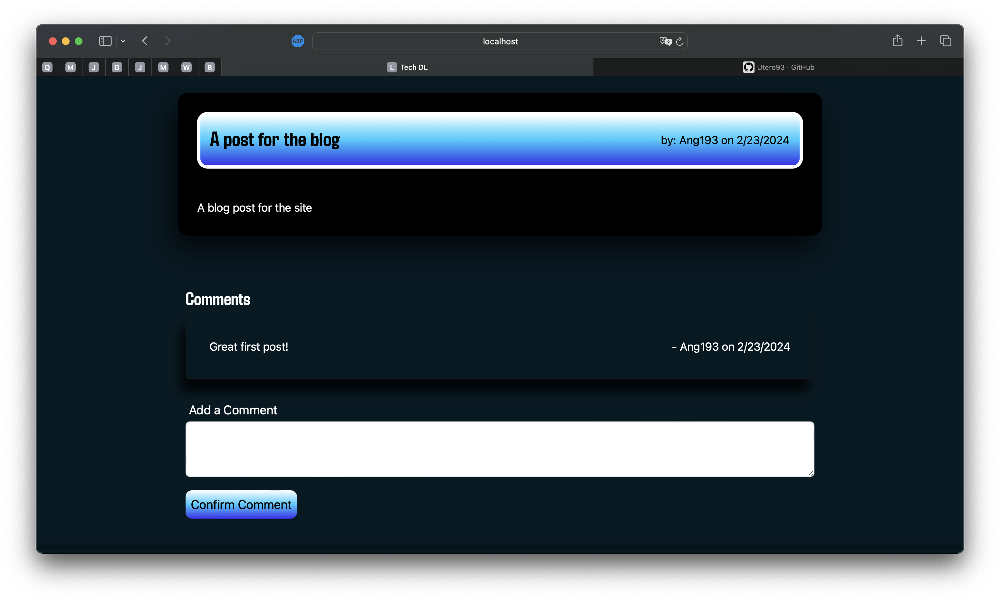
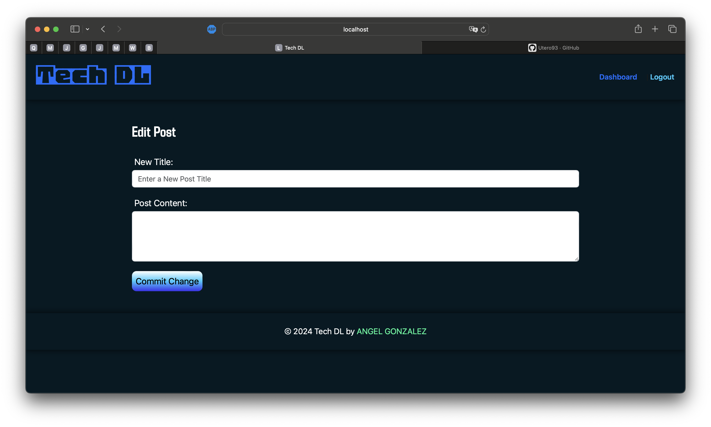

# CMS-MVC-BLOG-SITE

## License

This project is licensed under the [MIT License] - see [LICENSE](LICENSE) file for more details.

## Description

a CMS-style blog site similar to a Wordpress site, where developers can publish their blog posts and comment on other developers’ posts as well.

## Table of Contents

- [License](#license)
- [Description](#description)
- [URL](#URL)
- [Screenshots](#screenshots)
- [Usage](#usage)
- [Technologies](#technologies)
- [Questions](#questions)

## URL

[Click Here to View Deployed Site](https://daily-dev-dose-6efece3cf6b2.herokuapp.com/)

## Screenshots

### Dashboard

### Sign Up 

### Log in

### Post

### Post with comments

### Edit post

## Usage

### Account Setup:

- Visit the homepage and navigate to "Sign Up" or "Log in" to create an account or log in.

- Account Login: Click "Log in" in the navigation menu, enter your username and password, then click "Log in."

- Account Sign Up: Click "Sign Up" in the navigation menu, enter your desired username, email, and password, then click "Become a member!"

### Blog Post Interaction:

- Once logged in, you can contribute to Tech DL by creating new posts and commenting on others' contributions.

- Create a blog post: Navigate to "Dashboard" in the menu and under the heading "Create a New Post" input your post's title and content.  Last, click "Create" and your new blog post will be published!

- View Existing Blog Posts: Navigate "Home" by clicking on "Tech DL" in the header, then click on an existing blog posts' title to view.  Blog posts you've written can also be viewed by clicking their title in the "Your Posts" section in the "Dashboard".

### Commenting:

- To view or add a new comment, go to any blog post by clicking on its title from the homepage.

- Once open, you can view the comment history and contribute by adding new comments.

### Edit or Delete Blog Posts:

- Manage your blog posts by going to the "Dashboard," selecting the post you wish to edit or delete, and choosing the corresponding option.

- When editing a post, input a new title and content then click 'Save Changes'

### Account Logout:

- Click "Logout" in the navigation menu to securely log out of your account.

## Technologies

### Express [Version 4.18.2](https://expressjs.com/)

### MySql2 [Version 3.6.5](https://www.npmjs.com/package/mysql2)

### bcrypt [Version 5.1.1](https://www.npmjs.com/package/bcrypt)

### Handlebars [Version 7.1.2](https://www.npmjs.com/package/express-handlebars)

### Connect Session Store Sequelize[Versions 7.1.7](https://www.npmjs.com/package/connect-session-sequelize)

### Sequelize [Version 5.21.7](https://sequelize.org/)

### POSTMAN (https://www.postman.com/downloads/)

### Dotenv [Version 8.2.0](https://www.npmjs.com/package/dotenv)

## Questions

[Follow me on Github!](https://github.com/Dossman-thomas)

Have any further questions? Feel free to reach me via angel.m.gonzalez193@gmail.com